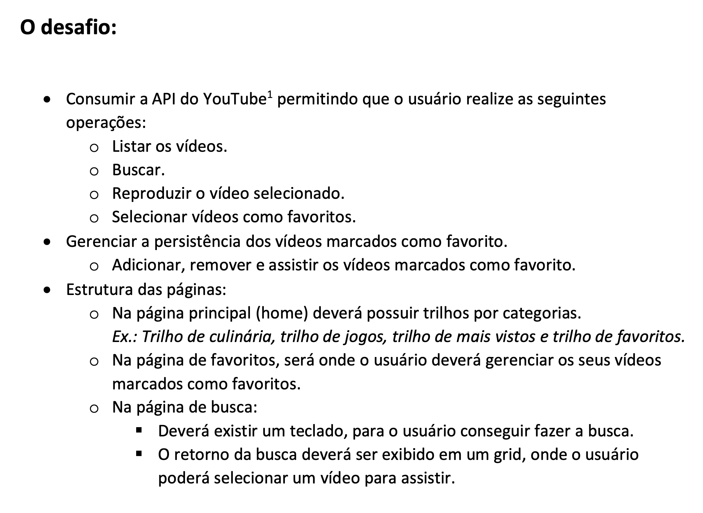

# Teste Canais Globo

### Objetivo

### Ambiente

`nodejs v12.18.3`  
`npm 6.14.6`  
`yarn 1.22.5`

### Para execução

- Clone este repositório  
  `git clone git@github.com:samuellevy/youtube-smart-app.git`

- Instale as dependências usando o seu gerenciador de pacotes.  
  `yarn` ou `npm install`

- Teste a aplicação.  
  `yarn test` ou `npm run test`

- Execute a aplicação.  
  `yarn start` ou `npm start`

### Bibliotecas utilizadas

`styled-components` - para criação mais rápida de componentes sem ciclo de vida e estilizados, pois é o que uso no meu dia-a-dia há um tempo para React, apesar de não ser um problema técnico não usar BEM css.

`axios` - para requisições http, pois é super adaptativo a browsers antigos.

### Considerações

- Foi respeitada a regra de `não utilize o Redux nem bibliotecas prontas para navegação e slider.`.

- Utilizei `flex-box`, pois nas orientações não falava sobre não poder usá-lo, apesar de saber que em Smartvs não se usa, por ser comum os browsers serem antigos.

- Preferi usar uma arquiteura mais simples, separada em components, scenes para as páginas (que no caso só tem uma), services, contexts.

- O arquivo [TODO.md](./TODO.md) tem todo o planejamento para a execução do teste.

### O que eu faria diferente:

- Criaria um componente único para o estilo de página que lista os tracks e os vídeos, pois atualmente está com bastante redundância de código.  

- Melhoraria o uso do teclado virtual. Criei um pois não achei nenhum que me agradasse já implementado em React.  

- Talvez menos prop-drilling e mais contexts.  

- Exploraria melhor a API do Youtube e buscaria funcionalidades interessantes para implementar.  

#### Obrigado pela oportunidade!
